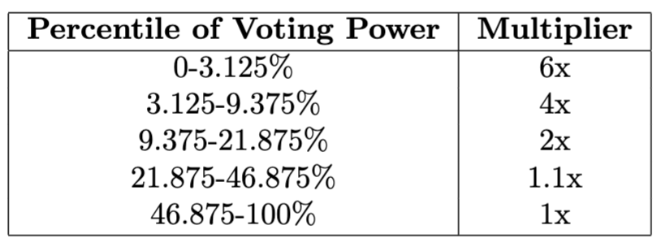

# Feature Overview

BandChain is a blockchain specifically designed for oracle use cases. Leveraging six years of experience in the blockchain space, we have reengineered the system from the ground up to support a wide range of existing oracle use cases and to ensure scalability for the growing ecosystem of blockchains and broader applications. This section outlines the key features of BandChain.

## Sub-second Data Latency

BandChain's block time is optimized to less than one second, with reserved block capacity dedicated to oracle-related operations. Validators, responsible for submitting real-time price data across hundreds of symbols, can instantly update prices as new information becomes available. This ensures BandChain serves as a reliable source for decentralized applications requiring minimal data latency, such as decentralized perpetual futures markets.

## Support for Any Blockchain

BandChain is designed to integrate seamlessly with existing interoperable protocols. This allows BandChain to extend its support to new blockchains as they emerge, provided they are supported by one of these underlying providers, facilitating rapid scalability. Additionally, BandChain introduces a novel, cost-efficient threshold signature provider. The system is built with extensibility in mind, allowing for the easy addition of more interoperable protocols as needed.

## Price Signal Generalization

BandChain supports not only spot cryptocurrency symbols but also extends to a variety of data types as required by the community. Tickers within the BandChain ecosystem are referred to as *signals* and can represent any asset with an associated price value. Band Protocol provides [registry repository](https://github.com/bandprotocol/registry) where anyone can propose additional signal specifications and the sources from which validators can obtain price information by submitting a pull request. Once approved and released, validators will automatically implement these changes, making the new signals available on BandChain.

## Data Security

Price data on BandChain can only be submitted by validators with a stake in $BAND, ensuring the data has real economic backing. While validators are not directly slashed for providing inaccurate data, as proving malicious intent is challenging, BandChain is highly resistant to price manipulation. Altering the medianized value would require control over more than half of the voting power. Validators are strongly disincentivized from providing inaccurate data as it risks losing delegations from the community. This approach has been validated by the successful operation of BandChain v2 over several years with zero instances of data corruption.

# Signaling Hub

The Signaling Hub is a pivotal component of BandChain, orchestrating which price symbols are published by the validators. It acts as a coordination mechanism to ensure that the most relevant and in-demand price data is continuously updated and made available to users.

Every $BAND token delegator has the ability to vote on which symbols should be included, with voting power directly proportional to their staked $BAND tokens. The more votes a symbol receives, the more frequently validators will update its price data on BandChain, in accordance with the Signaling Hub’s parameters. This system ensures that the data provided by BandChain reflects the preferences of the community.

## Signal Submission

Users with delegating power can submit `MsgSubmitSignals` to BandChain at any time to express their preferences. The message structure is as follows:

```
message Signal {
  string id = 1;
  int64 power = 2;
}

message MsgSubmitSignals {
  signer = "delegator";
  name   = "feeds/MsgSubmitSignals";

  string delegator = 1;
  repeated Signal signals = 2;
}
```

Upon transaction confirmation, BandChain updates the total power of the voted signals based on the submitted power. Users can vote for multiple signals, but the total voted power must not exceed the user's delegated $BAND power. Submitting a new `MsgSubmitSignals` will override any previous submissions.

## Feeding Interval

To incentivize $BAND holders to signal their desired price symbols and to optimize the load on BandChain, a symbol's feeding interval is calculated based on the total signaling power it receives, governed by several parameters:

- `MIN_INTERVAL`: The minimum possible feeding interval for a symbol.
- `MAX_INTERVAL`: The maximum possible feeding interval for a symbol.
- `POWER_STEP`: The voting power required for a symbol to move to the next feeding interval step.

The feeding interval algorithm operates as follows:

1. A symbol is eligible for price feeding if its power exceeds the `POWER_STEP`.
2. The symbol's *power factor* is determined by dividing the power by `POWER_STEP` and rounding down.
3. The feeding interval is calculated as `MAX_INTERVAL` divided by the power factor, capped at `MIN_INTERVAL`.

Validators are responsible for updating the price data of each symbol according to its feeding interval. Validators must submit price updates at least once per interval. Given that there are a hundred validators on BandChain, price updates occur much more frequently in practice. Developers of decentralized applications must signal the necessary symbols to ensure their availability with adequate feeding intervals.

## Current Feeds Update

At intervals defined by the `UPDATE_INTERVAL` governance parameter, the list of supported symbols and their feeding intervals are updated. To maintain data quality and efficient block space usage, only the top symbols, up to the maximum count specified by the `MAX_SUPPORTED_FEEDS` governance parameter, will be supported. This parameter may be adjusted by the community as needed and as more performant hardware becomes available to handle increased throughput. During the feeds update period, validators must update their software configurations to include potentially new signals with their respective feeding intervals.

# Price Submission

This section discusses the process by which price data is collected from each validator and the method used to aggregate these individual price data points for any given symbol into the final price data. This aggregation process not only ensures price integrity, given the honest majority of validators, but also allows the system to quickly reflect new price data points as they are submitted, without needing to react to rapid price movements.

## Validator's Price Data

`MsgSubmitSignalPrices` must be broadcasted by each validator to submit individual price data for all symbols listed in the signaling hub according to the specified interval for each symbol. Failure to do so will result in the validator being deactivated and losing a portion of their revenue, as well as that of their delegators.

```
enum PriceStatus {
  PRICE_STATUS_UNSPECIFIED = 0;
  PRICE_STATUS_UNSUPPORTED = 1;
  PRICE_STATUS_UNAVAILABLE = 2;
  PRICE_STATUS_AVAILABLE = 3;
}

message SignalPrice {
  PriceStatus price_status = 1;
  string signal_id = 2;
  uint64 price = 3;
}

message MsgSubmitSignalPrices {
  signer = "validator";
  name   = "feeds/MsgSubmitSignalPrices";

  string validator = 1;
  int64 timestamp = 2;
  repeated SignalPrice prices = 3;
}
```

Band Protocol does not dictate how validators should obtain the raw price data. However, the Band Protocol team provides an open-source reference implementation called *Bothan*, which can be found at the [Bothan repository](https://github.com/bandprotocol/bothan). Validators are required to disclose their methods for obtaining price data for each symbol. It is the responsibility of Band Protocol token holders to choose validators based on these disclosures, ensuring the quality of the data is maintained.

## Aggregation Algorithm

The aggregation algorithm in BandChain is designed to balance the amount of voting power required to influence the final medianized price data with the system’s ability to respond quickly to rapid price movements. Validators report data independently within the specified interval, which means that price data does not arrive simultaneously from all validators.

At any given time, the registered price for a symbol is the weighted median value of the prices reported by all validators, excluding those who report `UNAVAILABLE`. Price data is weighted by the validator’s voting power, with additional multipliers applied to prioritize more recent submissions.

BandChain applies multipliers to the most recent price points to ensure greater influence. The voting power is adjusted as follows:
{ width=275px }

Note that if the majority voting power of validators submits `UNSUPPORTED`, the aggregated final price will not be available, and the symbol will be registered as `INVALID`.

## Price Availability

At the end of each block, BandChain computes the weighted medianized price data for all symbols in the signaling hub and stores it on the blockchain. At this point, the price data becomes available for anyone to consume. For on-chain usage, refer to the subsequent sections. For off-chain usage, anyone running a BandChain node can directly query the price data using the Cosmos-SDK query interface to the feeds module.

# Data Tunnels

The previous sections describe how price data is continuously available on BandChain for public consumption. To utilize these prices on public blockchains without a trusted point of failure, decentralized application developers can use BandChain's *data tunnels* to transmit price data. This section details the architecture of data tunnels and user interactions.

## Data Tunnel Architecture

BandChain allows developers to create a *tunnel* specifying the pricing symbols (signals), the feeding interval, and the price deviation triggering condition. Once registered, BandChain continuously and automatically checks for data delivery conditions, which are met if any of the following occurs:

- The time since the last feeding interval delivery exceeds the specified feeding interval.
- The last fed price of the signal differs from the current price by more than the specified price deviation.

Each time price data is delivered, BandChain incurs a cost to the tunnel creator. Tunnel creators are responsible for monitoring the tunnel's balance and depositing more $BAND to ensure continuous availability. If the tunnel runs out of funds, it will be deactivated and stop triggering price feeds.

Developers can choose their preferred provider for inter-chain data transmission. BandChain supports various popular interoperable protocols as well as its native threshold signature-powered solution. Refer to subsequent sections for supported providers.

## New Tunnel Creation

Anyone can broadcast `MsgCreateTunnel` to create a new tunnel. The message specifies data feeding conditions, the initial $BAND deposit, and the data delivery route.

```
message SignalInfo {
  string signal_id = 1;
  uint64 soft_deviation_bps = 2;
  uint64 hard_deviation_bps = 3;
}

enum Encoder {
  ENCODER_UNSPECIFIED = 0;
  ENCODER_TYPE_FIXED_POINT_ABI = 1;
  ENCODER_TYPE_TICK_ABI = 2;
}

message MsgCreateTunnel {
  signer = "creator";
  name   = "tunnel/MsgCreateTunnel";

  repeated SignalInfo signal_infos = 1;
  uint64 interval = 2;
  Any route = 3;
  Encoder encoder = 4;
  repeated Coin deposit = 5;
  string creator = 6;
}
```

Once the tunnel is created, it will be assigned an ID for future reference, and a dedicated BandChain address will be generated. Anyone can send $BAND tokens to this address to cover data delivery costs.

## Data Delivery Fee

The fee for using a data tunnel consists of two parts. The first part is a fixed fee charged per data delivery. If a delivery contains multiple signals from the same tunnel, only one fixed fee will be charged. This fee is specified by the `TUNNEL_FIXED_FEE` governance parameter.

The second part of the fee depends on the utilized tunnel. Different tunnels may have varying charges. BandChain does not impose additional fees but may perform necessary conversions of $BAND to different tokens for fee payments. Refer to the section specific to interoperability providers for more details.

## Tunnel Modification
Once created, a tunnel can be modified by the creator. To do so, the `MsgEditTunnel` message must be broadcast.

```
message MsgEditTunnel {
  signer = "creator";
  name   = "tunnel/MsgEditTunnel";

  uint64 tunnel_id = 1;
  repeated SignalInfo signal_infos = 2;
  uint64 interval = 3;
  string creator = 4;
}
```

## Tunnel Activation

If a tunnel runs out of funds to pay for data delivery fees, it will be *deactivated* and stop checking for delivery conditions. To re-enable the tunnel, the creator can send $BAND to the tunnel's deposit address and broadcast `MsgActivateTunnel` to BandChain.

```
message MsgActivateTunnel {
  signer = "creator";
  name   = "tunnel/MsgActivateTunnel";

  uint64 tunnel_id = 1;
  string creator = 2;
}
```

In addition, the owner may voluntarily sends `MsgDeactivateTunnel` to pause data delivery logic.

```
message MsgDeactivateTunnel {
  signer = "creator";
  name   = "tunnel/MsgDeactivateTunnel";

  uint64 tunnel_id = 1;
  string creator = 2;
}
```

## Manual Triggering of a Tunnel

A tunnel can be manually triggered by the tunnel owner if certain conditions require immediate data delivery, bypassing the normal automated feeding intervals.

```
message MsgManualTriggerTunnel {
  signer = "creator";
  name   = "tunnel/MsgManualTriggerTunnel";

  uint64 tunnel_id = 1;
  string creator = 2;
}
```

# Threshold Signature
`[REDACTED]`

[comment]: One way that price data can be sent to a target

[comment]: ## TSS Group and Incentives

[comment]: ## Packet Creation

[comment]: ## Data Encoding Scheme

[comment]: ## Signature Aggregation

[comment]: ## Delivery to EVM Blockchains

# Integration with Interoperability Protocols
`[REDACTED]`
